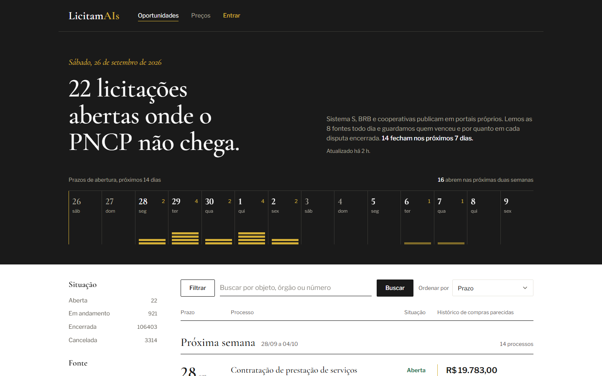

# LicitamAIs

Coleta diária e consulta de licitações e contratos que **não aparecem no PNCP** — Sistema S, BRB e cooperativas publicam em portais próprios — e dos **contratos de TI** de estatais federais (Caixa, Banco do Brasil, BBTS). Para cada disputa encerrada guarda quem venceu e por quanto, e transforma esse histórico em referência de preço.



## O que faz

- **Coleta** 9 fontes por API ou portal público, uma vez por dia, com sondas de sanidade por fonte (volume, frescor, campos obrigatórios) e incidente quando uma fonte quebra.
- **Guarda o resultado**: vencedor, CNPJ e valor de cada lote/contrato, com histórico de mudanças.
- **Mostra oportunidades** abertas com prazo, filtros por situação, fonte e modalidade, busca de texto completo e o histórico de compras parecidas ao lado de cada licitação.
- **Responde "quanto já pagaram"**: distribuição de preços adjudicados por objeto (mediana, quartis, extremos).
- **Avisa** pelo Telegram quando surge licitação que casa com as palavras de um alerta.


## Fontes

| Fonte | Acesso | O que entra |
|---|---|---|
| Sistema Indústria (CNI, SESI, SENAI, IEL) | portal GoBuyer | processos, lotes, vencedores e valores da sala de disputa pública |
| SESCOOP | portal GoBuyer | idem |
| SENAC (28 regionais) | API de transparência | processos e contratos com favorecido e valor |
| SEST/SENAT | API de transparência | processos e vencedores |
| BRB | API do portal de compras | processos e contratos |
| IGES-DF | CSV publicado | contratos (oculto no modo aberto: os termos vedam uso comercial) |
| Caixa, Banco do Brasil, BBTS | API de consulta do PNCP | só contratos de TI assinados desde 2023, classificados pelo objeto |

## Arquitetura

```
src/licitamais/
  adapters/        um adaptador por fonte: plan → fetch → parse (sem acesso ao banco)
  runner.py        executa o ciclo de uma fonte, aplica teto de chamadas e hidratação
  loader.py        normaliza e grava de forma idempotente (hash canônico, quarentena)
  probes.py        sondas de sanidade e incidentes por fonte
  scheduler.py     coleta agendada, backup e entrega de alertas
  alerts/          alertas de usuário, avisos ao operador, bot do Telegram
  api/             API FastAPI v2 (serve também o front compilado)
  contas/          login por link mágico e vínculo com o Telegram
migrations/        esquema SQLite versionado (única fonte de verdade do schema)
frontend/          React 19 + Vite + TanStack Query
deploy/            systemd, Caddy e backup para servidor Linux
tests/             pytest com amostras reais das fontes em tests/fixtures/
```

Regras que o código segue:

- Falha nunca vira lista vazia: resposta fora de 2xx é `FetchFailure`; lista vazia significa "consultei e não havia nada".
- A migração é a única fonte de verdade do schema; banco novo e banco existente percorrem o mesmo caminho.
- Dado de fonte externa é não confiável: validado na carga, escapado na exibição.

## Rodando localmente

Requisitos: Python 3.12+ e Node 20+.

```bash
pip install -r requirements.lock
pip install -e ".[dev]"

# banco e fontes
python -m licitamais --db data/licitamais.db --init
python -m licitamais --db data/licitamais.db              # coleta todas as fontes
python -m licitamais --db data/licitamais.db --source caixa
python -m licitamais --db data/licitamais.db --relatorio  # status por fonte

# front e API
cd frontend && npm ci && npm run build && cd ..
python -m licitamais.api --db data/licitamais.db --static frontend/dist --porta 8090
```

Sem SMTP configurado e com `LICITAMAIS_DEV=1`, o link de login sai no log da API em vez de ir por e-mail.

## Configuração

| Variável | Uso |
|---|---|
| `LICITAMAIS_BASE_URL` | endereço público usado no link de login |
| `LICITAMAIS_OPERADORES` | e-mails com acesso à tela de operador |
| `LICITAMAIS_SMTP_HOST`, `_PORT`, `_USER`, `_PASS`, `_FROM` | envio do link de login (STARTTLS) |
| `LICITAMAIS_TELEGRAM_TOKEN`, `LICITAMAIS_TELEGRAM_OPERADOR` | bot de alertas e avisos ao operador |
| `LICITAMAIS_ABERTO`, `LICITAMAIS_FONTES_OCULTAS`, `LICITAMAIS_CONFIA_CLOUDFLARE` | modo de leitura sem conta (ver [segurança](docs/SEGURANCA.md)) |
| `LICITAMAIS_DEV` | modo de desenvolvimento do e-mail |

Modelo de arquivo em [`deploy/.env.example`](deploy/.env.example); implantação em servidor em [`deploy/README.md`](deploy/README.md).

## Testes e qualidade

```bash
pytest                              # 605 testes, sem rede
ruff check . && ruff format --check .
cd frontend && npm test && npm run build
```

Os testes dos adaptadores rodam contra respostas reais gravadas das fontes (`tests/fixtures/amostras/`), com dados de pessoas físicas anonimizados.

## Segurança

Login sem senha por link mágico de uso único, sessões com CSRF, limites de requisição, CSP estrita e TLS sempre verificado na coleta. Detalhes em [docs/SEGURANCA.md](docs/SEGURANCA.md).
